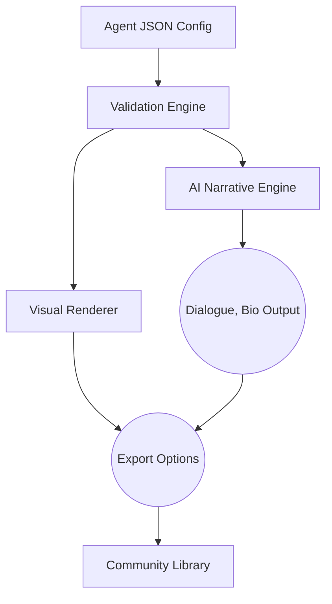

# ValoFusion: Custom Valorant Agent Creator & Visual Toolkit

**Welcome to ValoFusion!**  
ValoFusion transforms your creative spark into uniquely styled Valorant-inspired agent profiles with next-level visualization. Whether you’re a competitive strategy fan or design connoisseur, this toolkit blends game analysis, artwork customization, and AI-powered utility into one dynamic experience.

## 🛠️ What is ValoFusion?
ValoFusion is the definitive solution for crafting custom Valorant agent profiles, complete with interactive visualization and OpenAI/Claude-2 narrative generation. Spin up your ultimate agent ideas, simulate profiles, and preview visual compositions—all in a responsive, extensible platform.

---

## Table of Contents

- [🛫 Quick Start](#-quick-start)
- [🌈 Features & Benefits](#-features--benefits)
- [🎨 Example Profile Configuration](#-example-profile-configuration)
- [👾 Example Console Invocation](#-example-console-invocation)
- [🔮 Mermaid Diagram](#-mermaid-diagram)
- [🌍 Multilingual & Accessibility](#-multilingual--accessibility)
- [🤖 AI Integration](#-ai-integration)
- [🖥️ OS Compatibility Matrix](#-os-compatibility-matrix)
- [🏷️ SEO Integration & Unique Value](#-seo-integration--unique-value)
- [⚖️ License](#-license)
- [ℹ Disclaimer](#-disclaimer)
- [⬇️ Download](#-download)

---

## 🛫 Quick Start

**Install Requirements and Launch the Toolkit:**
1. Clone the repository.
2. Check `requirements.txt` for dependencies.
3. Use the configuration guide (see below) to generate a new agent.
4. Visualize, export, and integrate custom agents into presentations or text-based fan projects!

**Download the ValoFusion kit**:  

---

## 🌈 Features & Benefits

- **No-Limits Agent Creation:** Configure, generate, and visualize limitless Valorant-inspired agents with unique abilities, bios, and origins.
- **AI Narrative Engine:** Use OpenAI & Claude APIs to invent agent lore, dialogue, and synopses in seconds.
- **Responsive Visual Design:** Every profile shines across any device or platform—mobile, desktop, console.
- **SVG & JSON Export:** Plug your agents into presentations, wiki pages, or fan projects.
- **24/7 Smart Support:** Lightning-fast multilingual support bot—powered by Claude—for creative or technical questions at any hour.
- **Community-Driven Palette:** Share, import, or remix community profiles from a growing digital gallery.
- **SEO Optimized Outputs:** Convenient pre-filled meta descriptions and alt-text for sharing.
- **Playable Sim Preview:** Instant simulation of agent ability usage, with live-edit feedback.

---

## 🎨 Example Profile Configuration

Want to invent an agent? Copy this template into `profiles/phoenix2.json` and tweak away!
  
{
  "name": "Phoenix 2.0",
  "role": "Duelist",
  "affiliation": "Valorant Underground",
  "origin": "London, UK",
  "abilities": [
    {
      "name": "Flashflood",
      "type": "Blind",
      "description": "Casts a blinding flash that ricochets off surfaces."
    },
    {
      "name": "Pyroclastic Surge",
      "type": "Ultimate",
      "description": "Unleashes a wave of fire, healing Phoenix and damaging foes."
    }
  ],
  "backstory": "Risen from the streets of London, Phoenix 2.0 brings a fiery passion and precision tactics to the Valorant protocol."
}

Save your JSON file in `/profiles` and run the toolkit to unlock visualization magic!

---

## 👾 Example Console Invocation

Ready to see your agent come to life? Use the command below:

valofusion visualize --agent profiles/phoenix2.json --lang fr --ui responsive

- `--agent` : Path to your configuration file
- `--lang`  : Choose your output language (fr, es, de, etc.)
- `--ui`    : Render in responsive mode (ideal for any screen size)

---

## 🔮 Mermaid Diagram

A peek under ValoFusion’s creative hood:

---

## 🌍 Multilingual & Accessibility

- **Languages Supported:** English, Spanish, French, German, Turkish, Japanese, Korean, Russian, Portuguese (with instant translation upon request)
- **Accessibility:** Screenreader-optimized layouts; keyboard navigation; alt-text generated from agent profiles
- **Auto-Detect Locale:** Start in your browser’s language—no settings required

---

## 🤖 AI Integration

**OpenAI GPT-4 / Claude-2 API Used For:**
- Dynamic backstory, dialogue & character generation
- Multilingual biography drafting
- Ability flavor-text and voice-line inspiration
- Query support (ask the bot for profile tips!)

Get your API key, or run in "demo mode" for creative prompts—or choose your own journey.

---

## 🖥️ OS Compatibility Matrix

| OS          | Full Support | Known Issues        |
|-------------|:-----------:|--------------------|
|       | ✅ | -                  |
|     | ✅ | -                  |
|      | ✅ | -                  |
|  | ✅ | -                  |
|            | ⚠️  | Visual scaling     |
|      | ⚠️  | Keyboard input     |
|  | ✅ | - |

---

## 🏷️ SEO Integration & Unique Value

**ValoFusion** is more than a Valorant agent tool—it's a launchpad for sharing custom esports character design with the world. Social sharing, search engine enhanced tags, and mobile-first design all combine for viral-ready, unforgettable profiles.

Key SEO-friendly topics: "custom Valorant profile creation", "interactive agent visualization", "AI-powered game character toolkit", "responsive fan design for Valorant", "multilingual agent builder".

---

## ⚖️ License

ValoFusion is open-source under the MIT License. See the [LICENSE](./LICENSE) for the full text.

---

## ℹ Disclaimer

ValoFusion is an independently driven community project. All trademarks, game assets, and references to *Valorant* are property of Riot Games. This project does **not** inject, modify, or alter actual gameplay or Riot client files. For creative/design/fan use only, 2026.

---

## ⬇️ Download

Boost your creative arsenal—download ValoFusion now!  

---

*Copyright © 2026 ValoFusion Contributors.  
Let your mythos ignite!*